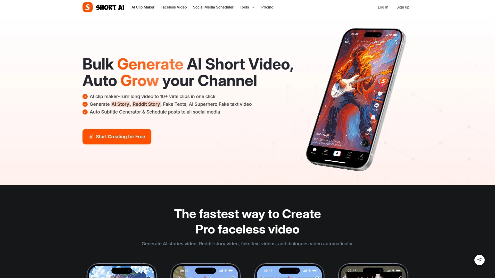
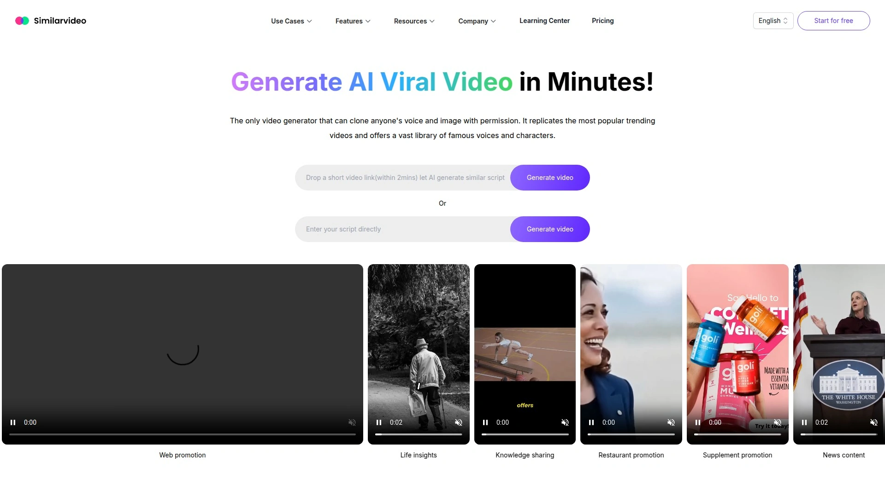

# 学会使用这14个AI视频生成软件,五分钟搞定专业视频制作

传统视频制作需要摄像设备、专业演员、复杂剪辑,不仅成本高昂还耗时数周,让无数中小企业和个人创作者望而却步。手动拍摄培训视频、营销短片、产品讲解时,面临着找不到合适的代言人、多语言配音成本高、后期剪辑技术门槛大等核心痛点。AI视频生成工具通过数字人生成、文本转视频、智能换脸等技术,可在几分钟内将文案自动转化为带真人形象和自然语音的专业视频,支持150+种语言配音和4K画质输出。本文精选14款经过市场验证的AI视频创作平台,从数字人播报到创意短片生成,从企业培训到社交媒体内容,覆盖视频创作全流程需求,助您找到操作简便、效果逼真、性价比高的智能制作方案。

## **[AKOOL](https://akool.com)**

Inc 5000榜首的企业级AI视频创作套件

AKOOL在2025年Inc 5000增长最快公司榜单中排名第一,是专为品牌和创作者打造的全方位AI视频平台。平台覆盖从脚本编写到视频导出的完整工作流,特别擅长制作保持品牌一致性的定制化内容。

**实时流媒体数字人**是AKOOL的独特优势,支持生成能够实时移动和讲话的虚拟主播,非常适合虚拟直播、在线问答等互动场景。不同于其他平台的预录制内容,AKOOL允许用户作为数字角色实时出现在镜头前与观众互动。语音克隆和多语言TTS功能支持克隆真人声音或使用内置语音库,覆盖150+种语言和口音,帮助YouTuber无需雇佣翻译和配音演员即可为不同地区自动配音视频。

图像转视频AI工具可将静态照片转化为流畅的4K动态视频,系统通过先进AI算法确保画面清晰、动画自然。面部保持一致且逼真,表情自然,角色身份始终对齐,创造更可信的视觉效果。内置换脸、配音、视觉特效等全套工具,让静态图像焕发生机。

可定制AI数字人库支持选择多样化形象并添加品牌元素,特别适合制作符合企业形象的讲解视频或培训模块。品牌工具包和协作功能允许上传logo、色彩方案和字体,确保每个视频匹配品牌调性,实时协作工具简化团队工作流程。

2025年产品更新包括扩展的数字人库、多语言支持、全新故事板编辑器实现场景级精细控制,以及与营销和社交媒体工具的增强集成,4K导出选项让AKOOL成为企业和代理团队可扩展协作视频工作流的稳健选择。企业级功能包括API接口供开发者集成,适合大规模个性化视频生产。

## **[HeyGen](https://www.heygen.com)**

全球10万+用户信赖的AI数字人视频平台

HeyGen以其易用性和高质量输出在市场中脱颖而出,无需演员、摄像机或剪辑技能即可创建专业视频。平台服务超过10万付费客户,工具涵盖文本转视频、语音翻译和数字人技术。

**唇形同步和面部表情**在行业对比中获得四星评级,牙齿清晰度、头部运动和分辨率表现出色。每月提供3个免费视频额度,付费计划价格实惠且支持无限制方案,相比D-ID无月度免费配额更具性价比。

语音克隆功能让数字人以用户真实声音自然讲话,支持任何语言,全球触达能力强。视频翻译工具可将现有视频自动翻译为多种语言并同步口型,大幅降低国际化内容制作成本。

合作伙伴计划提供20%循环收益持续12个月,针对每位客户的Creator或Team付费计划,推荐资格有效期为点击链接后60天。目标受众包括创作者、视频编辑、营销人员、房地产代理和学习发展专业人士,特别是YouTube、TikTok或影视行业活跃用户。月最低支付30美元,仅通过PayPal发放。

## **[Synthesia](https://www.synthesia.io)**

企业级AI视频制作的全球标准

Synthesia是财富500强企业广泛采用的AI视频平台,专注于为大型组织提供可扩展的视频创作解决方案。平台特别适合需要批量生成培训视频、产品演示和内部沟通内容的企业。

**140+种语言支持**和多样化的AI数字人库确保企业能够为全球团队创建本地化内容。模板库丰富,涵盖培训、营销、销售等多种业务场景,快速启动项目无需从零设计。

视频编辑器界面直观,支持团队协作和版本控制,适合多人同时处理大量视频项目。与主流企业工具集成,可嵌入LMS学习管理系统和内部知识库。

合作伙伴计划面向内容创作者、营销人员和行业影响者开放,帮助推广AI视频制作的价值。企业定价采用定制报价模式,根据用户数和视频产量灵活配置。

## **[Fliki](https://fliki.ai)**

30%终身收益的文本转视频专家

Fliki是将文本和语音转化为视频内容的AI平台,以其丰富的媒体库和逼真AI语音著称。特别适合快速将博客文章、脚本转化为吸引眼球的视频内容。

**合作伙伴计划慷慨**,提供30%终身循环收益且Cookie追踪30天,每推荐25位付费用户获得250美元奖金,50位获得500美元,100位获得1000美元。月最低支付50美元,通过Wise或PayPal发放。

超过1000种AI语音和75+种语言选项让内容能够触达全球受众。文本转语音技术自然流畅,听感接近真人朗读。丰富的视觉素材库包含数百万图片、视频片段和音乐,无需外部素材即可完成制作。

平台提供免费计划供新用户试用,付费版从每月21美元起,解锁更多功能和导出时长。界面简洁易懂,即使没有视频制作经验的用户也能在几分钟内上手。

## **[InVideo](https://invideo.io)**

面向社交媒体创作者的快速视频生成器

InVideo专注于帮助营销人员和社交媒体创作者快速制作吸引眼球的短视频内容。5000+专业模板覆盖YouTube、Instagram、Facebook等主流平台的常见视频类型。

**智能视频编辑器**支持文本转视频、自动字幕生成、背景音乐匹配等自动化功能。用户只需输入脚本或文章链接,系统自动选择合适素材并生成完整视频。

媒体库包含800万+免版权图片和视频片段,无需担心版权问题。AI语音合成支持多种语言和音色,适合制作多语言营销内容。

合作伙伴计划对内容创作者、博主、社交媒体影响者开放,通过推荐获得持续收益。定价从免费计划到商业版涵盖不同需求,年付享受大幅折扣。

## **[Descript](https://www.descript.com)**

播客和视频编辑的AI革命

Descript将文本编辑的简单性带入视频和音频制作,特别受播客主和YouTube创作者青睐。通过编辑文字稿即可剪辑视频,革命性地简化后期制作流程。

**AI语音克隆和超逼真配音**功能让用户可用自己的声音修正视频中的口误,无需重新录制。自动移除填充词(嗯、啊等)和长时间停顿,让内容更流畅专业。

屏幕录制、多轨编辑、绿幕移除等功能集成在统一界面,一站式完成视频创作。Audiogram生成器可将音频片段转化为可视化波形视频,适合社交媒体分享。

合作伙伴计划为每位新订阅用户提供25美元收益,全球内容创作者均可申请加入。通过PartnerStack平台追踪业绩并每月通过PayPal自动支付。免费计划包含基础功能,付费版解锁更多AI能力和导出时长。

## **[VEED.io](https://www.veed.io)**

在线视频编辑的快速解决方案

VEED.io是基于浏览器的视频编辑平台,无需下载软件即可完成专业剪辑。特别适合需要快速制作和分享视频的远程团队。

**自动字幕生成**支持多种语言,准确率高且可自定义字幕样式。AI数字人和语音翻译功能让用户能够创建多语言视频内容。屏幕录制、视频压缩、格式转换等实用工具集成在平台,满足日常视频处理需求。

协作功能允许团队成员在同一项目上实时工作,评论和审批流程高效顺畅。模板库涵盖社交媒体帖子、广告、演示文稿等多种场景。

合作伙伴计划对创作者和营销人员开放,申请审批后即可开始推荐赚取收益。定价从免费基础版到商业计划分层清晰,满足不同规模团队需求。

## **[Kapwing](https://www.kapwing.com)**

团队协作的在线视频创作工作室

Kapwing提供基于云端的视频编辑平台,强调团队协作和快速迭代。适合营销团队、内容创作工作室和社交媒体经理使用。

**循环收益结构**是Kapwing合作伙伴计划的亮点,持续从推荐客户的订阅中获得收益。免费加入且收益取决于推广效果,为高流量创作者提供可观回报。

智能剪辑工具自动识别视频中的精彩片段,适合从长视频提取短片用于社交媒体。字幕编辑器支持多种语言和样式定制,提升视频可访问性和参与度。

实时协作功能让团队成员可同时编辑同一项目,评论和反馈直接在视频时间轴上标注。模板和预设简化重复性任务,提高工作流程效率。

## **[Creatify AI](https://creatify.ai)**

短视频广告的AI自动化引擎

Creatify专注于利用AI技术批量生成短视频广告,特别适合电商卖家和数字营销人员。平台将产品链接自动转化为吸引眼球的广告视频。

**25%循环收益**通过Rewardful仪表板实时追踪推广进展,每笔符合条件的购买均可获得收益。三步简单流程:注册获取独家链接、发布创意内容分享链接、赚取持续收益。

AI分析产品特性自动生成脚本、选择合适场景和配音,大幅缩短广告制作时间。多变体测试功能可同时生成多个版本,通过A/B测试找到最佳创意。

适合对数字营销和AI技术有热情的推广者,目标受众包括电商企业主、广告代理商和社交媒体营销人员。定价灵活,从入门计划到企业方案满足不同规模需求。

## **[Steve AI](https://www.steve.ai)**

高达40%收益的动画视频创作平台

Steve AI专注于将文本和脚本转化为动画和真人视频,提供丰富的角色和场景库。特别适合制作讲解视频、教育内容和产品演示。

**合作伙伴计划收益高达40%**且无限制上限,为每位推荐用户或企业线索获得报酬。提供及时的月度收益报告和专属合作伙伴经理,享受独家交易和优惠。

动画资产库包含数千个可定制角色、道具和背景,支持创建各种风格的动画视频。真人视频模式支持使用AI数字人呈现内容,适合企业培训和营销场景。

三步注册流程:表达兴趣加入计划、通过首选渠道推荐潜在用户、通过唯一推荐码赚取收益。定价从每月15美元的基础计划到45美元的启动计划,企业客户可定制方案。

## **[Runway ML](https://runwayml.com)**

前沿AI视频生成的艺术家之选

Runway是AI视频生成领域的先锋,提供超过30种AI驱动的创意工具。Gen-4视频生成模型在画质和创意控制上处于行业领先地位。

**创意合作伙伴计划**为精选艺术家、团队和创作者提供新工具和AI模型的独家访问权。每位会员获得免费无限计划、100万积分、合作机会和专属活动。

文本生成视频功能允许用户描述创意想法,AI生成符合描述的独特视频片段。图像动画化工具可将静态图片转化为流畅动态视频,适合创意项目和艺术探索。

Runway被众多影视制作团队采用,包括Amazon热门剧集"House of David"和Madonna庆祝巡演的视觉效果制作。平台注重创意自由度和艺术表达,适合专业视频创作者和实验性项目。

## **[Pollo AI](https://pollo.ai)**

双层收益结构的AI视频生成器

Pollo AI是创新的AI视频生成平台,允许用户在几分钟内创建令人惊艳的视频。双层收益结构让推广者不仅从直接推荐中获益,还能从下级推荐的销售中赚取收益。

**一级收益30%**来自直接推荐的每笔首次购买、续费或升级,二级收益10%来自下级推荐的销售。例如直接推荐100美元购买获得30美元,下级推荐100美元额外获得10美元。

实时追踪仪表板允许监控点击、转化和收益,透明掌握推广效果。支持团队随时准备回答问题并提供及时协助。

前沿AI技术让观众能够快速释放创造力,产品本身的吸引力降低推广难度。适合有稳定流量的内容创作者、评测博主和AI工具爱好者。

## **[Short AI](https://www.short.ai)**

30%收益的短视频自动化工具

Short AI专注于将长视频自动剪辑为适合社交媒体的短片,特别受YouTube和播客创作者欢迎。AI识别长视频中的精彩片段并自动添加字幕、转场效果。

**30%合作伙伴计划**为推广者提供可观收益,适合服务视频创作者社群的影响者和工具评测者。平台自动化程度高,大幅节省手动剪辑时间,用户满意度和续订率较高。

智能高光检测算法分析视频内容,自动标记最具吸引力的时刻。批量处理功能支持同时处理多个视频,提升高产量创作者的工作效率。

定制品牌元素如片头片尾、水印和字幕样式,保持视频输出的一致性。与主流视频平台集成,简化发布和分享流程。

## **[Similarvideo](https://similarvideo.ai)**

规模化内容生产的AI视频平台

Similarvideo提供企业级AI视频解决方案,帮助品牌大规模生产个性化视频内容。特别适合需要批量创建产品视频、客户见证和营销素材的企业。

**合作伙伴计划**面向代理商、咨询顾问和技术集成商开放,提供收益分享和联合营销机会。白标选项允许合作伙伴以自己品牌提供服务。

API接口支持将视频生成能力集成到现有工作流和应用中,适合技术型客户。模板系统确保批量生产的视频保持品牌一致性。

多语言和本地化功能让企业能够为不同市场快速创建定制内容。分析和报告工具追踪视频表现,优化内容策略。

***

## 常见问题

**AI生成的数字人视频看起来真实吗?**

现代AI技术在数字人逼真度上已取得显著突破,HeyGen和AKOOL等平台的唇形同步、面部表情、头部运动均获得四星以上评级。AKOOL的实时流媒体数字人能够自然互动,表情细腻且身份一致。但需注意,视频真实度受多个因素影响:数字人模型质量、脚本自然度、语音合成效果等。建议选择提供高分辨率输出和多样化数字人库的平台如Synthesia或HeyGen,并在脚本编写时保持对话式语气而非机械朗读。大多数平台提供免费试用,可先测试几个数字人形象和语音效果,选择最接近预期的组合。

**免费AI视频工具够用吗还是必须付费?**

免费计划适合初学者试用和小规模项目,HeyGen每月提供3个免费视频,Fliki和VEED.io也有功能可用的免费版。但免费版通常有时长限制(1-2分钟)、水印标识、导出分辨率较低(720p)等约束。对于专业用途或批量生产,付费计划更合适:InVideo和Creatify的付费版解锁无限视频、4K导出、去除水印、商用授权等关键功能。企业客户应考虑Synthesia或AKOOL的定制方案,包含团队协作、API接口、品牌工具包等高级能力。建议策略是从免费版开始熟悉工具,当视频需求增长或对输出质量要求提高时再升级。

**如何选择适合自己的AI视频工具?**

选择工具前明确主要用途:制作培训视频和企业内容选Synthesia或HeyGen,社交媒体短视频选InVideo或Creatify,播客和长视频编辑选Descript,艺术创意项目选Runway ML。考察数字人库是否多样化、语音合成是否自然、支持的语言数量、输出分辨率和格式。界面易用性很重要,Fliki和VEED.io以简洁友好著称适合新手,Runway和Descript功能强大但学习曲线稍陡适合专业用户。预算方面,Fliki和Steve AI性价比高起步价15-21美元/月,企业级需求可选AKOOL或Synthesia。建议利用免费试用期测试2-3款工具,对比输出质量和工作流适配度再做决定。

***

## 总结

AI视频生成技术正在彻底改变内容创作方式,从需要专业团队和昂贵设备的传统制作模式,转变为任何人都能在几分钟内完成专业视频的智能化流程。本文介绍的14款工具各具特色,从数字人播报到动画制作,从短视频剪辑到企业培训,覆盖视频创作的多元化需求和预算范围。**[AKOOL](https://akool.com)** 凭借其Inc 5000榜首地位、实时流媒体数字人技术、150+种语言支持、4K画质输出、完整的品牌定制能力以及从图像转视频到换脸特效的全套工具,特别适合追求专业品质、需要规模化生产视频内容、重视品牌一致性的企业和创作者,是平衡创意自由度、技术先进性和企业级可靠性的顶级选择。无论您是营销人员、培训师、内容创作者还是企业主,合理运用AI视频工具都能显著降低制作成本,缩短生产周期,让视频营销和沟通变得触手可及。
